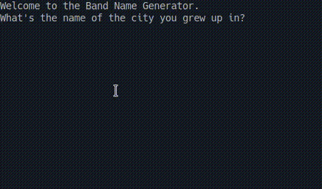

## Day 1 

    Goal: Learn the basics of Python.
    
        - Printing
        - Commenting
        - Debugging
        - String Manipulation
        - Variables

### What will be Make Today?
    - Band Name Generator Program.

- [Angela's Version on replit](https://replit.com/@appbrewery/band-name-generator-end)
----------------------------------------------------------------------------------------
- [day-1-printing-start](https://replit.com/@Prakash4844/day-1-printing-start)
- [day-1-printing-end](https://replit.com/@Prakash4844/Day-1-Printing-end)
- [Day-1-1-Solution](https://replit.com/@Prakash4844/Day-1-1-Solution)
- [Day-1-2-Solution](https://replit.com/@Prakash4844/Day-1-2-Debugging)
- [Day-1-Input](https://replit.com/@Prakash4844/Day-1-Input)
- [Day-1-Input-Solution](https://replit.com/@Prakash4844/Day-1-input-Exercise)
- [Day-1-variables](https://replit.com/@Prakash4844/day-1-variables)
- [Day-1-variables-Solution](https://replit.com/@Prakash4844/day-1-variable-exercise)
- [My Band Name Generator Version on replit](https://replit.com/@Prakash4844/band-name-generator)

I won't be doing further exercise on ReplIt. Frankly, it Sucks.

