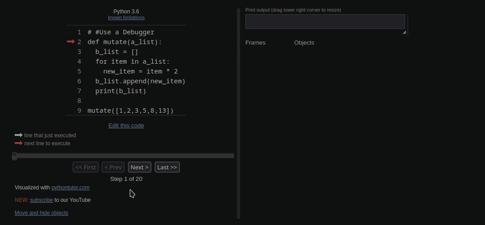

## Day 13

    Goal: Things we will learn in Python.
        - Debugging

### What will be Make Today?

----------------------------------------------------------------------------------------
- [Debug Exercises](https://repl.it/@appbrewery/day-13-start)

### My Files
- [13-1-Debugging_Assumptions](13-1-Debugging_Assumptions.py)
- [13-2-Debugging_Reproduce_bug](13-2-Debugging_Reproduce_bug.py)
- [13-3-Debugging_Play_computer](13-3-Debugging_Play_computer.py)
- [13-4-Debugging_Red_Squiggly_line](13-4-Debugging_Red_Squiggly_line.py)
- [13-5-Debugging_Print](13-5-Debugging_Print.py)
- [13-6-Debugger](13-6-Debugger.py)
- [13-Exercise-1](13-Exercise-1.py)
- [13-Exercise-2](13-Exercise-2.py)
- [13-Exercise-3](13-Exercise-3.py)

-----------------------------------------------------------------------------------------

