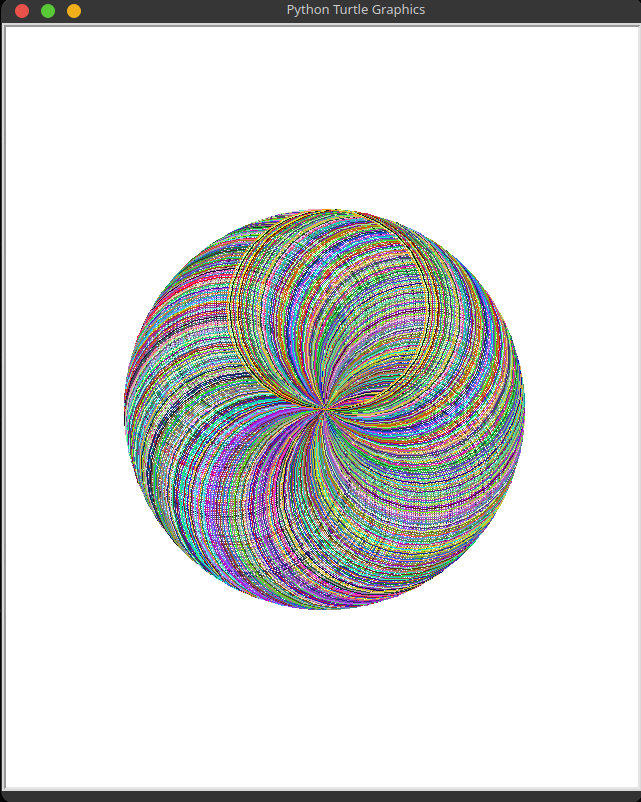

## Day 18

    Goal: Things we will learn in Python.
        - Turtle
        - Importing modules
        - Tuples

### What will be Make Today?
    - Dotted Odd Art.

----------------------------------------------------------------------------------------
- [Angela's version](https://replit.com/@appbrewery/quiz-game-final?embed=1)
- [Trinklet Turtle Color](https://trinket.io/docs/colors)
- [Turtle Colors](https://cs111.wellesley.edu/reference/colors)
- [Turtle Graphics](https://docs.python.org/3/library/turtle.html)
- [Random Walk](https://en.wikipedia.org/wiki/Random_walk)
- [RGB Colors](https://www.rapidtables.com/web/color/RGB_Color.html)
- [RGB](https://www.w3schools.com/colors/colors_rgb.asp)
- [Color Picker](https://www.w3schools.com/colors/colors_picker.asp)
- [Colorgram Package](https://pypi.org/project/colorgram.py/)

### My Files

- [Turtle_1](Turtle_Challenge_1.py)
- [Turtle_2](Turtle_Challenge_2.py)
- [Turtle_3](Turtle_Challenge_3.py)
- [Turtle_4](Turtle_Challenge_4.py)
- [Turtle_5](Turtle_Challenge_5.py)
- [Final Project](Final_Project.py)

------------------------------------------------------------------------------------
