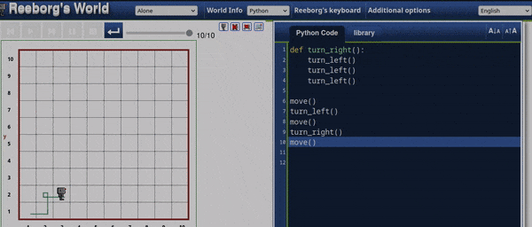
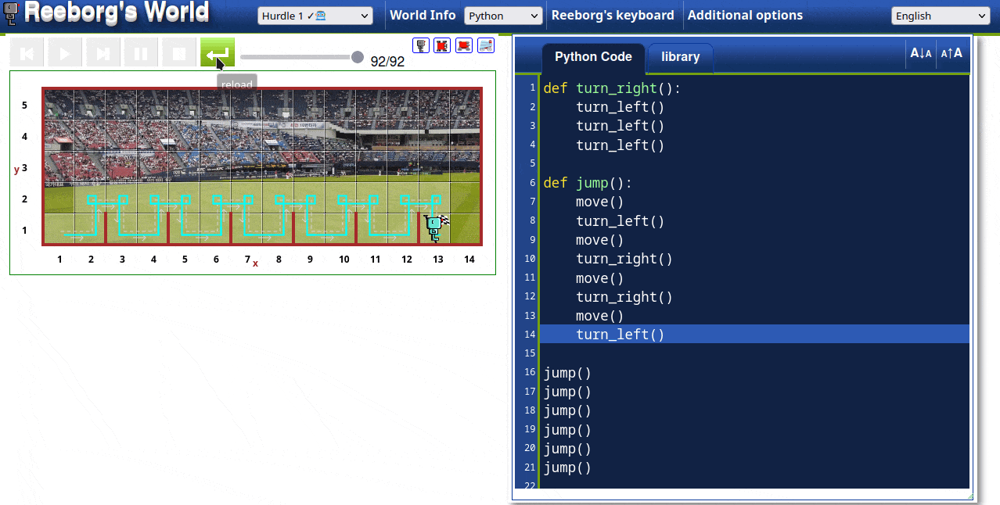
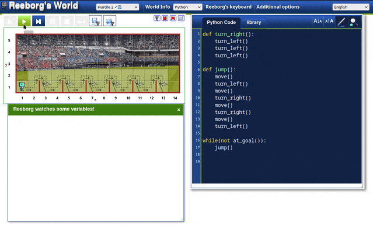
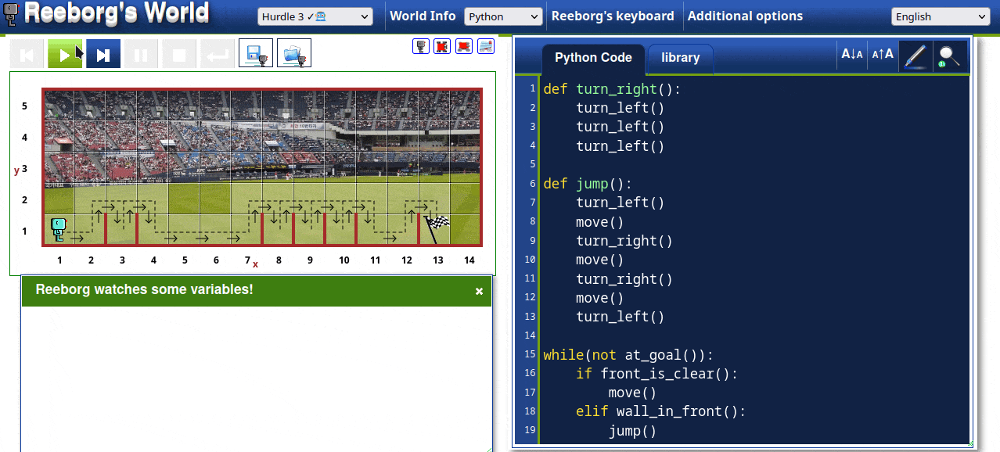
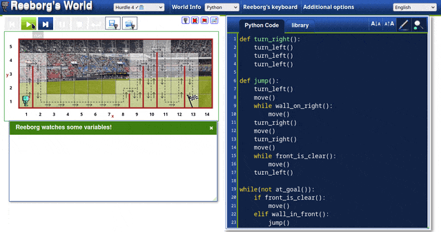
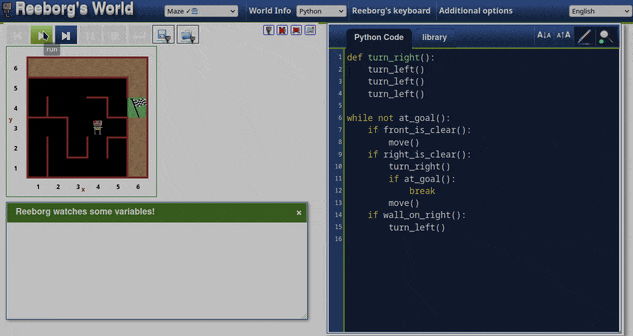

## Day 6

    Goal: Things we will learn in Python.
        - Code-blocks
        - Indentation
        - While-loops
        - Functions

### What will be Make Today?
    - Karel The Robot.

----------------------------------------------------------------------------------------
- [Built-in Functions in Python](https://docs.python.org/3/library/functions.html)
- [PEP 8 - Python Styling](https://peps.python.org/pep-0008/)
- [Reeborg's World](https://reeborg.ca/reeborg.html)

### My Files
#### 6-0

#### 6-1

#### 6-2

#### 6-3

#### 6-4

### Final

----------------------------------------------------------------------------------------

### Test Cases - 1

### Test Cases - 2

### Test Cases - 3

