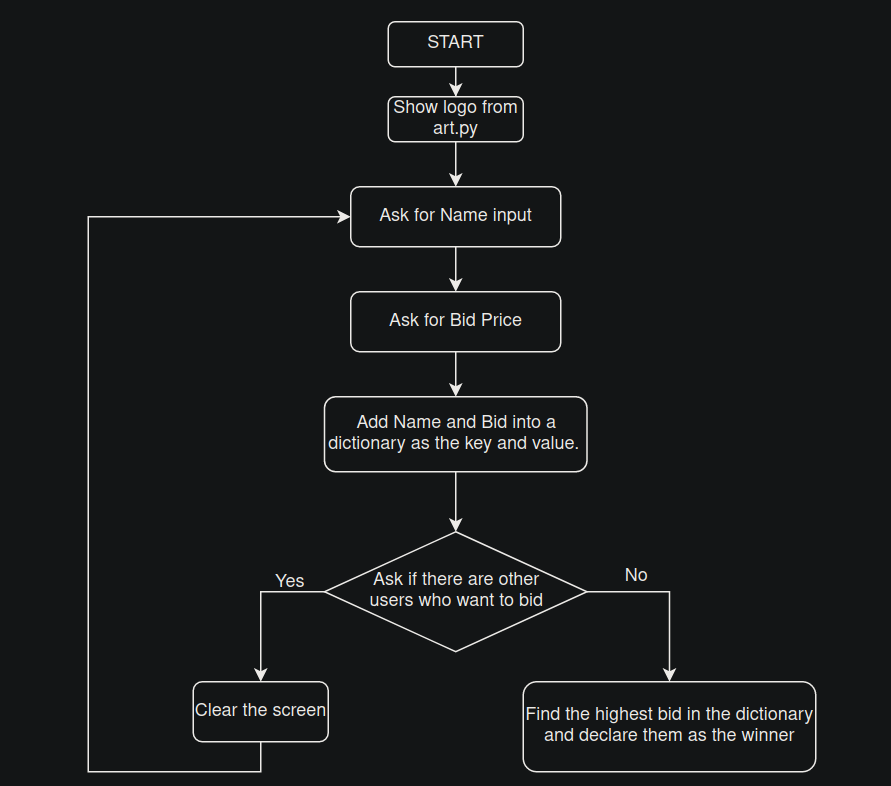

## Day 9

    Goal: Things we will learn in Python.
        - Dictionaries
        - Nesting

### What will be Make Today?
    - Blind Auction.

----------------------------------------------------------------------------------------
- [Angela's version](https://replit.com/@appbrewery/blind-auction-completed)

### My Files
- [Art](Art.py)
- [9-1-Dictionary](9-1-Dictionary.py)
- [9-1-Grade-Hogwarts-Exercise](9-1-Grade-Hogwarts-Exercise.py)
- [9-2-Nested_Dictionaries_and_list](9-2-Nested_Dictionaries_and_list.py)
- [9-2-Travel-log-Exercise](9-2-Travel-log-Exercise.py)
- [Final_Project_Blind_Auction](Final_Project_Blind_Auction.py)

----------------------------------------------------------------------------------------
